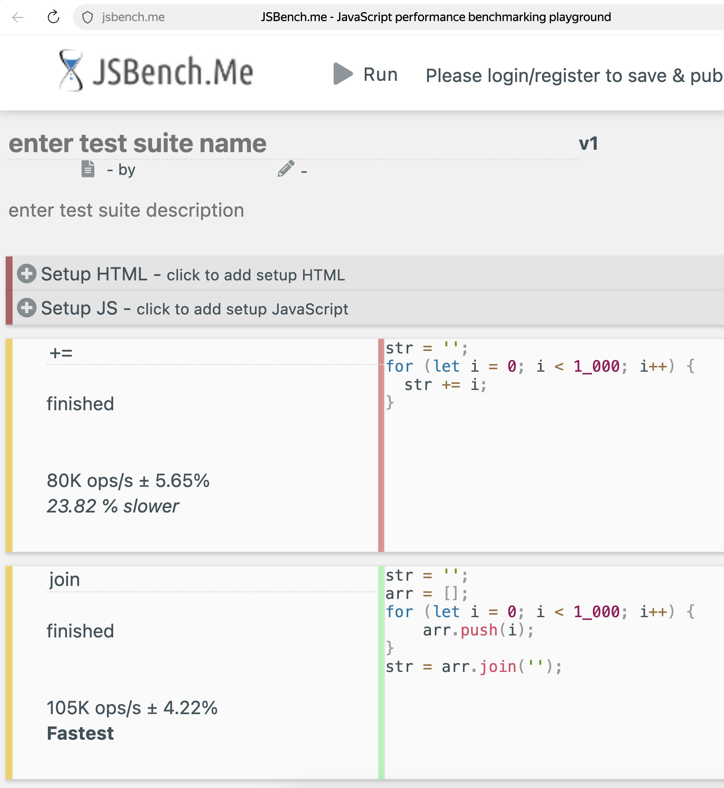
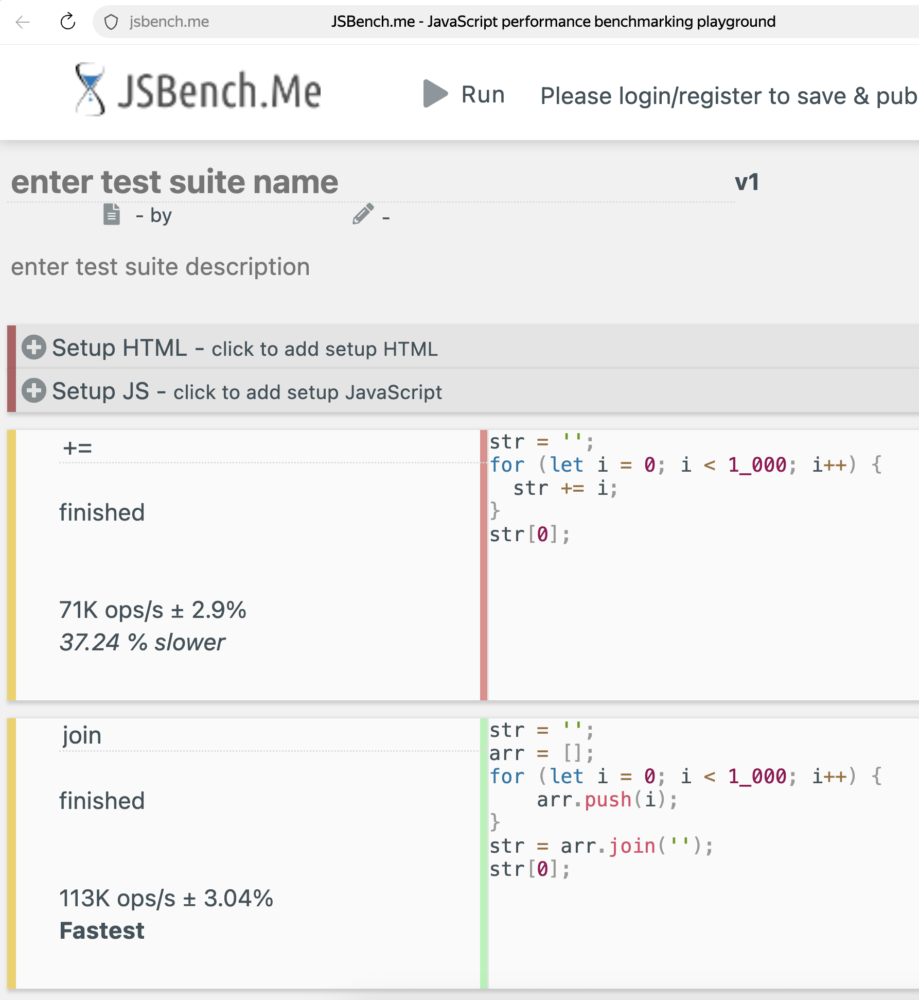
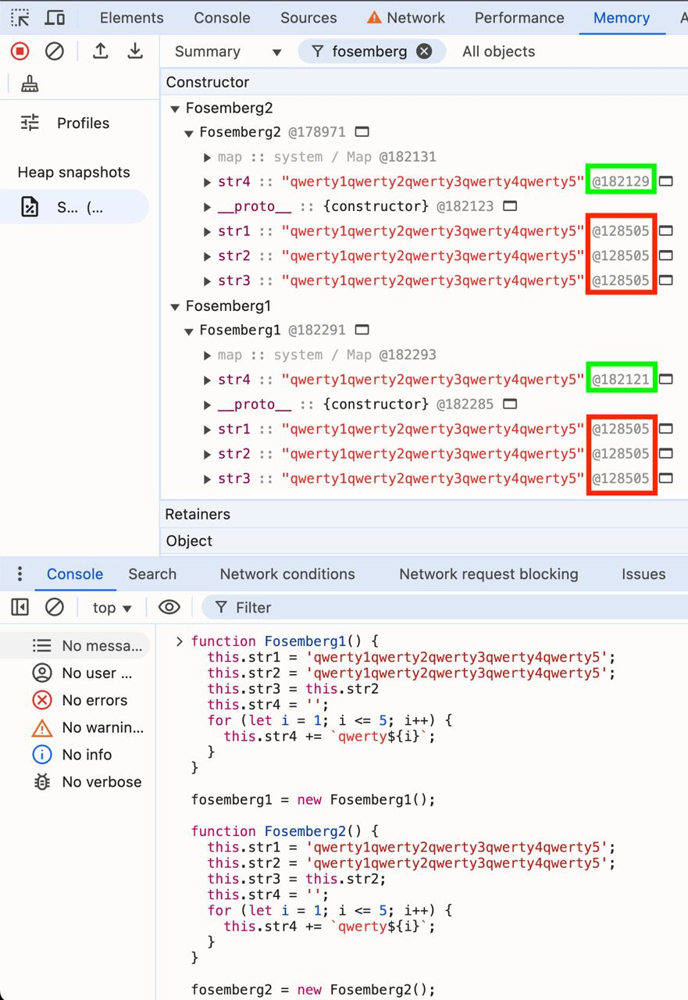
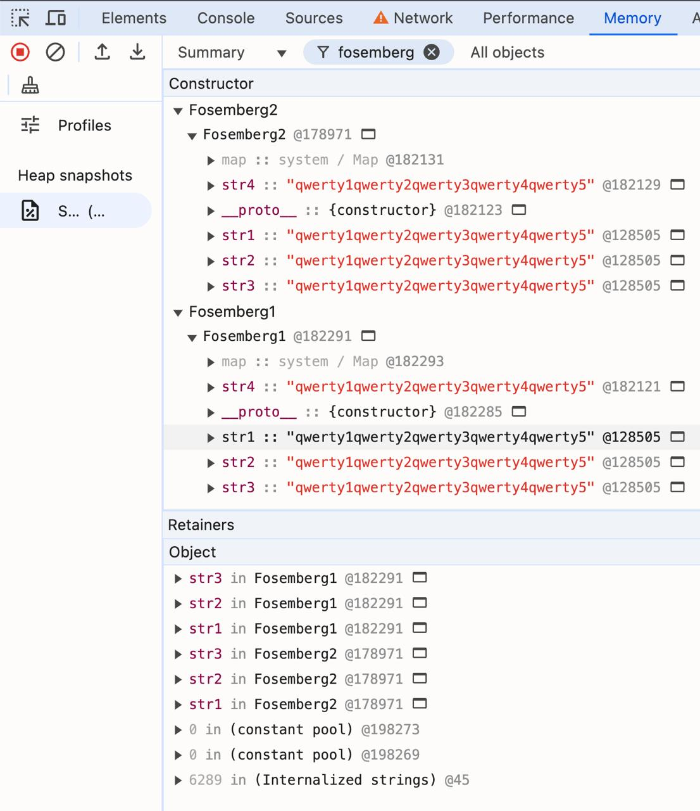

# v8 strings

QR Code to this page:


## Speedtest `+=` vs `join`

### `+=` code

```js
str = '';
for (let i = 0; i < 1_000; i++) {
  str += i;
}
```

### `join` code

```js
str = '';
arr = [];
for (let i = 0; i < 1_000; i++) {
	arr.push(i);
	str = arr.join('');
}
```

### JSBench.Me

#### Generating stroke



https://jsbench.me/wymmwc5lqz/1

#### Using stroke



https://jsbench.me/vvmmwc6bts/1

## What to build

V8 is an embeddable engine designed as a library. It can be integrated into any C++ application.
**Primary consumers:**
- **Chromium / Chrome** — the primary consumer
- **Node.js** — server-side JavaScript
- **d8** — a minimal debugging shell, shipped with V8

## How to build v8 on mac arm

### Main steps

1. find v8 repo
   https://github.com/v8/v8
2. get `depot_tools` (package of helper scripts)
   https://www.chromium.org/developers/how-tos/install-depot-tools/
3. build d8 (v8 debugging shell)
   https://v8.dev/docs/d8

#### Set up the environment

4. install xcode
   https://apps.apple.com/us/app/xcode/id497799835
5. install Xcode Command Line Tools

### full build sh in 9 lines

```sh
git clone https://chromium.googlesource.com/chromium/tools/depot_tools.git --depth 1

echo "export PATH=$(pwd)/depot_tools:\$PATH" >> ~/.zshrc
source ~/.zshrc

fetch --nohistory v8

cd v8
gn gen out/foo --args='target_cpu="arm64"'
ninja -C out/foo d8

echo "console.log('Hello world!');" > test.js
./out/foo/d8 test.js
```

### video

1. download from github: [./build_v8_d8.mp4](./build_v8_d8.mp4)
2. see on yandex disk: [https://disk.yandex.ru/i/pvOYS6Pa6MfYZA](https://disk.yandex.ru/i/pvOYS6Pa6MfYZA)

## DevTools Memory Snapshots

#### `+=`

```js
function FooPlus() {
  this.str = '';
  for (let i = 0; i < 1_000; i++) {
    this.str += i;
  }
}
fooPlus = new FooPlus();
```

#### `join`

```js
function FooJoin() {
  this.arr = [];
  this.str = '';
  for (let i = 0; i < 1_000; i++) {
    this.arr.push(i);
  }
  this.str = this.arr.join('');
}
fooJoin = new FooJoin();
```






## Debug sources

https://github.com/v8/v8/commit/c68f8492328eff48b8dcc04164431b7147706087

## tq

https://v8.dev/docs/torque#how-torque-generates-code

## Related links

- Юрий Карпов - Измеряем настоящую цену абстракций в JavaScript
  [https://youtu.be/UNHNgHWyCGc](https://youtu.be/UNHNgHWyCGc)
- Внутреннее представление и оптимизации строк в JavaScript-движке V8: «отмываем» строки, «обгоняем» C++
  https://habr.com/ru/companies/ruvds/articles/745008/
- Read about torque
  https://www.jfokus.se/jfokus20-preso/V8-Torque--A-Typed-Language-to-Implement-JavaScript.pdf
- Alternative Installing V8 on a Mac doc
  https://gist.github.com/kevincennis/0cd2138c78a07412ef21