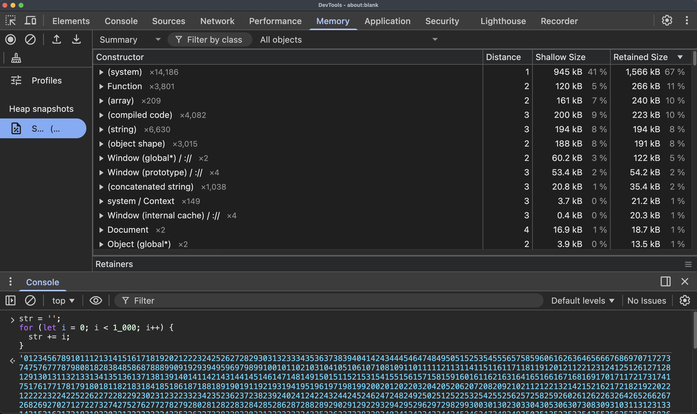
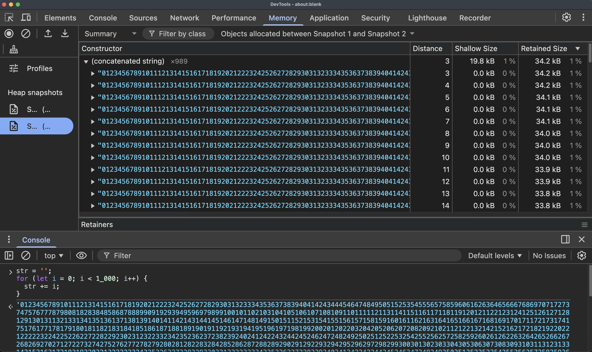
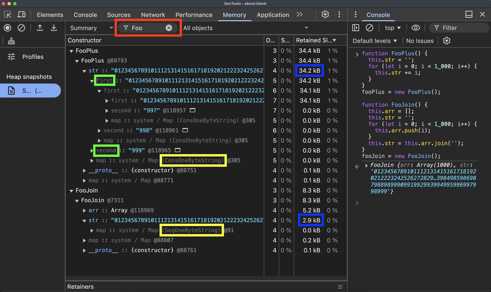
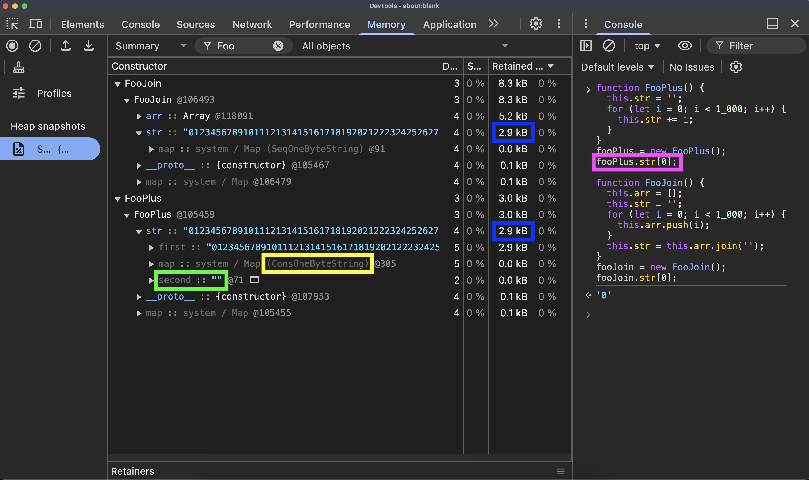
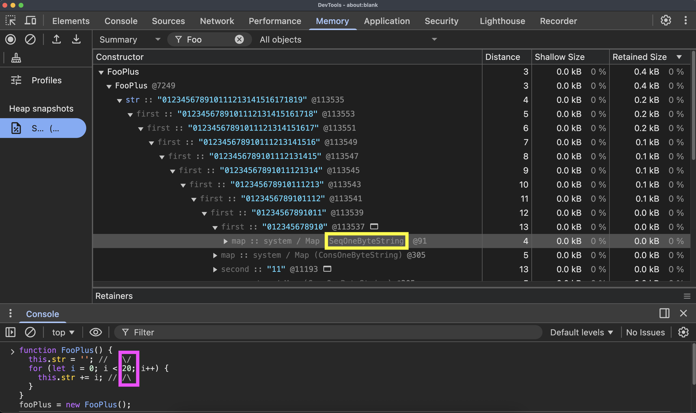
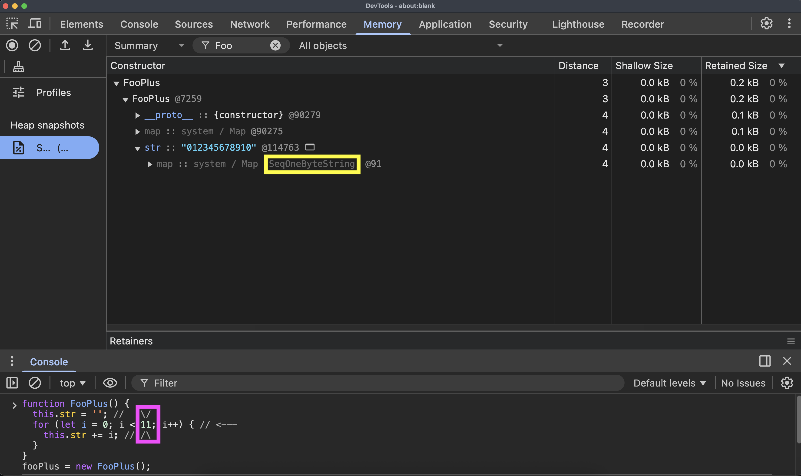

# v8 strings

QR Code to this page:


## What are we going to compare
### `+=` code

```js
str = '';
for (let i = 0; i < 1_000; i++) {
  str += i;
}
```

### `join` code

```js
arr = [];
for (let i = 0; i < 1_000; i++) {
	arr.push(i);
}
str = arr.join('');
```

## What to build

V8 is an embeddable engine designed as a library. It can be integrated into any C++ application.
**Primary consumers:**
- **Chromium / Chrome** — the primary consumer
- **Node.js** — server-side JavaScript
- **d8** — a minimal debugging shell, shipped with V8

## How to build v8 on mac arm

### Main steps

1. find v8 repo
   https://github.com/v8/v8
2. get `depot_tools` (package of helper scripts)
   https://www.chromium.org/developers/how-tos/install-depot-tools/
3. build d8 (v8 debugging shell)
   https://v8.dev/docs/d8

#### Set up the environment

4. install xcode
   https://apps.apple.com/us/app/xcode/id497799835
5. install Xcode Command Line Tools

### full build sh in 9 lines

```sh
git clone https://chromium.googlesource.com/chromium/tools/depot_tools.git --depth 1

echo "export PATH=$(pwd)/depot_tools:\$PATH" >> ~/.zshrc
source ~/.zshrc

fetch --nohistory v8

cd v8
gn gen out/foo --args='target_cpu="arm64"'
ninja -C out/foo d8

echo "console.log('Hello world!');" > test.js
./out/foo/d8 test.js
```

### video

1. see on YouTube: [https://youtu.be/cxtgi7Ti330](https://youtu.be/cxtgi7Ti330)
2. download from github: [build_v8_d8.mp4](build_v8_d8.mp4)
3. see on yandex disk: [https://disk.yandex.ru/i/pvOYS6Pa6MfYZA](https://disk.yandex.ru/i/pvOYS6Pa6MfYZA)

## DevTools Memory Snapshots

### Try code asis

```js
str = '';
for (let i = 0; i < 1_000; i++) {
  str += i;
}
```



### Try 2 snapshots



### With classes

```js
function FooPlus() {
  this.str = '';
  for (let i = 0; i < 1_000; i++) {
    this.str += i;
  }
}
fooPlus = new FooPlus();

function FooJoin() {
  this.arr = [];
  this.str = '';
  for (let i = 0; i < 1_000; i++) {
    this.arr.push(i);
  }
  this.str = this.arr.join('');
}
fooJoin = new FooJoin();
```



### Using strings

```js
function FooPlus() {
  this.str = '';
  for (let i = 0; i < 1_000; i++) {
    this.str += i;
  }
}
fooPlus = new FooPlus();
fooPlus.str[0];          // <---

function FooJoin() {
  this.arr = [];
  this.str = '';
  for (let i = 0; i < 1_000; i++) {
    this.arr.push(i);
  }
  this.str = this.arr.join('');
}
fooJoin = new FooJoin();
fooJoin.str[0];          // <---
```



### 20 elements

```js
function FooPlus() {
  this.str = ''; //   \/
  for (let i = 0; i < 20; i++) { // <---
    this.str += i; // /\
  }
}
fooPlus = new FooPlus();
```



### 11 elements

```js
function FooPlus() {
  this.str = ''; //   \/
  for (let i = 0; i < 11; i++) { // <---
    this.str += i; // /\
  }
}
fooPlus = new FooPlus();
```



## Debug sources

commit:  
https://github.com/fosemberg/v8/commit/a483d91a7adcd43a72d75d1eb924eaba361b5131

test scripts: `test_js/join.js`, `test_js/ConsString.js`

### Join. How it's working

`arr.join('')` works in 3 phases:

```
["1","2","3","4","5","6","7","8","9","10","11","12","13","14","15","16","17","18","19","20"].join('')

Phase 1: Collect                    Phase 2: Allocate        Phase 3: Copy
─────────────────                   ─────────────────        ─────────────────

Buffer (FixedArray, capacity=21)    SeqOneByteString         SeqOneByteString
┌──────────────────────────────┐    (length=31)              (length=31)
│ [0] next_chunk = Undefined   │    ┌───────────────────┐    ┌───────────────────┐
│ [1] "1"    totalLen += 1 → 1 │    │                   │    │1234567891011121314│
│ [2] "2"    totalLen += 1 → 2 │    │   31 bytes of     │    │151617181920       │
│ [3] "3"    totalLen += 1 → 3 │    │   uninitialized   │    │                   │
│ [4] "4"    totalLen += 1 → 4 │    │   memory          │    │ WriteToFlat:      │
│ [5] "5"    totalLen += 1 → 5 │    │                   │    │  "1"  → 1 byte    │
│ [6] "6"    totalLen += 1 → 6 │    └───────────────────┘    │  "2"  → 1 byte    │
│ [7] "7"    totalLen += 1 → 7 │                             │  ...              │
│ [8] "8"    totalLen += 1 → 8 │    AllocateSeqOneByteString │  "10" → 2 bytes   │
│ [9] "9"    totalLen += 1 → 9 │    (totalLen = 31)          │  ...              │
│[10] "10"   totalLen += 2 →11 │                             │  "20" → 2 bytes   │
│[11] "11"   totalLen += 2 →13 │                             └───────────────────┘
│[12] "12"   totalLen += 2 →15 │
│[13] "13"   totalLen += 2 →17 │    One allocation,          One pass over
│[14] "14"   totalLen += 2 →19 │    exact size known         buffer chunks
│[15] "15"   totalLen += 2 →21 │
│[16] "16"   totalLen += 2 →23 │
│[17] "17"   totalLen += 2 →25 │
│[18] "18"   totalLen += 2 →27 │
│[19] "19"   totalLen += 2 →29 │
│[20] "20"   totalLen += 2 →31 │
└──────────────────────────────┘
```

Entry point:

[`src/builtins/array-join.tq`](https://github.com/fosemberg/v8/commit/a483d91a7adcd43a72d75d1eb924eaba361b5131#diff-42030b040dea1fc49191c1982c9a87a91a1dc9a5b8c20aaeac7e4c750583ef34R781) — `ArrayPrototypeJoin`
```diff
  transitioning javascript builtin ArrayPrototypeJoin(
      js-implicit context: NativeContext, receiver: JSAny)(...arguments): JSAny {
+   Print("=== Array.prototype.join ===");
    const sepObj: JSAny = arguments[0];

    // 1. Let O be ? ToObject(this value).
    const o: JSReceiver = ToObject_Inline(context, receiver);

    // 2. Let len be ? ToLength(? Get(O, "length")).
    const len: Number = GetLengthProperty(o);
    ...
  }
```

#### Phase 1: Collect

Iterate over array elements, accumulate their string lengths into a `Buffer`.

[`src/builtins/array-join.tq`](https://github.com/fosemberg/v8/commit/a483d91a7adcd43a72d75d1eb924eaba361b5131#diff-42030b040dea1fc49191c1982c9a87a91a1dc9a5b8c20aaeac7e4c750583ef34R191) — `Buffer.Add`
```diff
  macro Add(
      implicit context: Context)(str: String, nofSeparators: intptr,
      separatorLength: intptr): void {
    dcheck(this.index != 1 || this.head == this.chunk);
    const writeSeparators: bool = this.index == 1 | nofSeparators > 1;
    this.AddSeparators(nofSeparators, separatorLength, writeSeparators);

    this.totalStringLength =
        AddStringLength(this.totalStringLength, str.length_intptr);
+   Print("[Phase 1: Collect] Buffer.Add element length", Convert<uintptr>(str.length_intptr));
    if (TaggedEqual(str, this.lastString)) {
      this.RepeatLast();
    } else {
      this.AppendToChunk(str);
      this.lastString = str;
    }
    this.isOneByte = IsOneByteStringMap(str.map) & this.isOneByte;
  }
```

[`src/builtins/array-join.tq`](https://github.com/fosemberg/v8/commit/a483d91a7adcd43a72d75d1eb924eaba361b5131#diff-42030b040dea1fc49191c1982c9a87a91a1dc9a5b8c20aaeac7e4c750583ef34R313) — `NewBuffer`
```diff
  macro NewBuffer(len: uintptr, sep: String): Buffer {
    const cappedBufferSize: intptr =
        len >= kMaxBufferChunkSize ? kMaxBufferChunkSize : Signed(len + 1);
    dcheck(cappedBufferSize > 0);
    const chunk = AllocateZeroedFixedArray(cappedBufferSize);
+   Print("[Phase 1: Collect] NewBuffer capacity", Convert<uintptr>(cappedBufferSize));
    chunk.objects[0] = Undefined;
    return Buffer{
      head: chunk,
      chunk: chunk,
      index: 1,
      totalStringLength: 0,
      isOneByte: IsOneByteStringMap(sep.map),
      lastString: Null
    };
  }
```

#### Phase 2 + 3: Allocate + Copy

Allocate a single `SeqOneByteString` (or `SeqTwoByteString`) with the total length.

[`src/builtins/array-join.tq`](https://github.com/fosemberg/v8/commit/a483d91a7adcd43a72d75d1eb924eaba361b5131#diff-42030b040dea1fc49191c1982c9a87a91a1dc9a5b8c20aaeac7e4c750583ef34R354) — `BufferJoin`
```diff
  macro BufferJoin(implicit context: Context)(buffer: Buffer,
                      sep: String): String {
    dcheck(IsValidPositiveSmi(buffer.totalStringLength));
    if (buffer.totalStringLength == 0) return kEmptyString;

    // Fast path when there's only one chunk and one buffer element.
    if (buffer.index == 2 && buffer.head == buffer.chunk) {
      const chunk: FixedArray = buffer.head;
      typeswitch (chunk.objects[1]) {
        case (str: String): {
          return str;
        }
        case (nofSeparators: Smi): {
          dcheck(nofSeparators > 0);
          return StringRepeat(context, sep, nofSeparators);
        }
        case (Object): {
          unreachable;
        }
      }
    }

    const length: uint32 = Convert<uint32>(Unsigned(buffer.totalStringLength));
+   Print("[Phase 2: Allocate] SeqString total length", Convert<uintptr>(length));
    const r: String = buffer.isOneByte ? AllocateSeqOneByteString(length) :
                                         AllocateSeqTwoByteString(length);
-   return CallJSArrayArrayJoinConcatToSequentialString(
+   const result: String = CallJSArrayArrayJoinConcatToSequentialString(
        buffer.head, buffer.index, sep, r);

+   Print("[Phase 3: Copy] result:");
+   PrintStringSimple(result);
+   return result;
  }
```

#### Phase 3: Copy

Copy all collected chunks into the pre-allocated sequential string.

[`src/objects/objects.cc`](https://github.com/fosemberg/v8/commit/a483d91a7adcd43a72d75d1eb924eaba361b5131#diff-74dfba41a5031dfde1d477d7e4f8fb76791e1d7f8e15a2bb354366bda8ce89bcR4406) — `ArrayJoinConcatToSequentialString`
```diff
  Address JSArray::ArrayJoinConcatToSequentialString(
      Isolate* isolate, Address raw_chunk_list_head,
      uintptr_t raw_last_chunk_length, Address raw_separator, Address raw_dest) {
    DisallowGarbageCollection no_gc;
    DisallowJavascriptExecution no_js(isolate);
    Tagged<FixedArray> chunk_list_head =
        Cast<FixedArray>(Tagged<Object>(raw_chunk_list_head));
    Tagged<String> separator = Cast<String>(Tagged<Object>(raw_separator));
    Tagged<String> dest = Cast<String>(Tagged<Object>(raw_dest));

    uint32_t last_chunk_length = static_cast<uint32_t>(raw_last_chunk_length);
+   PrintF("\n[Phase 3: Copy] dest_length=%d, encoding=%s\n",
+          dest->length(),
+          StringShape(dest).IsSequentialOneByte() ? "OneByte" : "TwoByte");
    if (StringShape(dest).IsSequentialOneByte()) {
      WriteChunkListToFlat(chunk_list_head, last_chunk_length, separator,
                           Cast<SeqOneByteString>(dest)->GetChars(no_gc),
                           dest->length());
    } else {
      WriteChunkListToFlat(chunk_list_head, last_chunk_length, separator,
                           Cast<SeqTwoByteString>(dest)->GetChars(no_gc),
                           dest->length());
    }
    return dest.ptr();
  }
```

[`src/objects/objects.cc`](https://github.com/fosemberg/v8/commit/a483d91a7adcd43a72d75d1eb924eaba361b5131#diff-74dfba41a5031dfde1d477d7e4f8fb76791e1d7f8e15a2bb354366bda8ce89bcR4268) — `WriteChunkListToFlat` (key parts)
```diff
+ uint32_t chunk_index = 0;
  while (true) {
    Tagged<Object> maybe_next_chunk = chunk->get(0);
    bool is_last_chunk = IsUndefined(maybe_next_chunk);
    uint32_t chunk_len = chunk->ulength().value();
    uint32_t length = is_last_chunk ? last_chunk_length : chunk_len;
+   PrintF("[Phase 3: Copy] processing chunk #%u, %u elements\n",
+          chunk_index++, length - 1);
    ...
      if (V8_LIKELY(!element_is_special)) {
        Tagged<String> string = Cast<String>(element);
        const uint32_t string_length = string->length();
+       PrintF("[Phase 3: Copy]   WriteToFlat: %u bytes\n",
+              string_length);

        String::WriteToFlat(string, sink, 0, string_length);
        sink += string_length;
        num_separators = 1;
      }
    ...
  }
```

#### Example

`cat test_js/join.js`
```js
const arr = [];
for (let i = 1; i <= 20; i++) {
  arr.push(i);
}
const str = arr.join('');

str[0];
```

`./out/foo/d8 test_js/join.js`
```
=== Array.prototype.join ===
[Phase 1: Collect] NewBuffer capacity: 21
[Phase 1: Collect] Buffer.Add element length: 1
[Phase 1: Collect] Buffer.Add element length: 1
[Phase 1: Collect] Buffer.Add element length: 1
[Phase 1: Collect] Buffer.Add element length: 1
[Phase 1: Collect] Buffer.Add element length: 1
[Phase 1: Collect] Buffer.Add element length: 1
[Phase 1: Collect] Buffer.Add element length: 1
[Phase 1: Collect] Buffer.Add element length: 1
[Phase 1: Collect] Buffer.Add element length: 1
[Phase 1: Collect] Buffer.Add element length: 2
[Phase 1: Collect] Buffer.Add element length: 2
[Phase 1: Collect] Buffer.Add element length: 2
[Phase 1: Collect] Buffer.Add element length: 2
[Phase 1: Collect] Buffer.Add element length: 2
[Phase 1: Collect] Buffer.Add element length: 2
[Phase 1: Collect] Buffer.Add element length: 2
[Phase 1: Collect] Buffer.Add element length: 2
[Phase 1: Collect] Buffer.Add element length: 2
[Phase 1: Collect] Buffer.Add element length: 2
[Phase 1: Collect] Buffer.Add element length: 2

[Phase 2: Allocate] SeqString total length: 31

[Phase 3: Copy] dest_length=31, encoding=OneByte
[Phase 3: Copy] processing chunk #0, 20 elements
[Phase 3: Copy]   WriteToFlat: 1 bytes
[Phase 3: Copy]   WriteToFlat: 1 bytes
[Phase 3: Copy]   WriteToFlat: 1 bytes
[Phase 3: Copy]   WriteToFlat: 1 bytes
[Phase 3: Copy]   WriteToFlat: 1 bytes
[Phase 3: Copy]   WriteToFlat: 1 bytes
[Phase 3: Copy]   WriteToFlat: 1 bytes
[Phase 3: Copy]   WriteToFlat: 1 bytes
[Phase 3: Copy]   WriteToFlat: 1 bytes
[Phase 3: Copy]   WriteToFlat: 2 bytes
[Phase 3: Copy]   WriteToFlat: 2 bytes
[Phase 3: Copy]   WriteToFlat: 2 bytes
[Phase 3: Copy]   WriteToFlat: 2 bytes
[Phase 3: Copy]   WriteToFlat: 2 bytes
[Phase 3: Copy]   WriteToFlat: 2 bytes
[Phase 3: Copy]   WriteToFlat: 2 bytes
[Phase 3: Copy]   WriteToFlat: 2 bytes
[Phase 3: Copy]   WriteToFlat: 2 bytes
[Phase 3: Copy]   WriteToFlat: 2 bytes
[Phase 3: Copy]   WriteToFlat: 2 bytes
[Phase 3: Copy] result:
1234567891011121314151617181920
```

### ConsString (`+=`). How it's working

`str += i` works in 3 phases:

```
str = ''; for (let i = 1; i <= 20; i++) { str += i; } str[0];

Phase 1: StringAdd → new SeqString (len < 13, full copy each time)
──────────────────────────────────────────────────────────────────

i=1:  "" + "1"           → allocate SeqString(1),  copy "1"
i=2:  "1" + "2"          → allocate SeqString(2),  copy "1"+"2"
i=3:  "12" + "3"         → allocate SeqString(3),  copy "12"+"3"
 ...                        each += allocates a new string and copies everything
i=9:  "12345678" + "9"   → allocate SeqString(9),  copy "12345678"+"9"
i=10: "123456789" + "10" → allocate SeqString(11), copy "123456789"+"10"

Phase 1+2: StringAdd + AllocateConsString (len ≥ 13, no copy — just a pointer)
───────────────────────────────────────────────────────────────────────────────

i=11: "12345678910" + "11"               (len=13 ≥ kMinLength → ConsString!)

                    ConsString (len=13)
                    ╱           ╲
             "12345678910"      "11"
              (SeqString)     (SeqString)

i=12: cons(13) + "12"                    (len=15 ≥ 13 → ConsString)

                    ConsString (len=15)
                    ╱           ╲
             ConsString(13)     "12"
             ╱          ╲
      "12345678910"     "11"

i=13: cons(15) + "13"                    (len=17 ≥ 13 → ConsString)

                    ConsString (len=17)
                    ╱           ╲
             ConsString(15)     "13"
             ╱          ╲
      ConsString(13)    "12"
      ╱          ╲
"12345678910"   "11"
 ...

i=20: cons(29) + "20"                    (len=31 ≥ 13 → ConsString)

                         ConsString (len=31)
                         ╱           ╲
                  ConsString(29)     "20"
                  ╱          ╲
            ConsString(27)   "19"
            ╱          ╲
      ConsString(25)   "18"
       ...
 ConsString(13)
 ╱           ╲
"12345678910" "11"


Phase 3: Flatten (triggered by str[0])
──────────────────────────────────────

         ConsString (len=31)                SeqOneByteString (len=31)
         ╱           ╲                      ┌───────────────────────────────┐
  ConsString(29)     "20"        ──►        │1234567891011121314151617181920│
  ╱          ╲                              └───────────────────────────────┘
ConsString(27) "19"
 ...                                   Allocate one SeqString(31),
                                       walk the tree, WriteToFlat all leaves
```

#### Phase 1: StringAdd

Each `+=` calls `StringAdd` — receives left and right strings.

[`src/builtins/builtins-string-gen.cc`](https://github.com/fosemberg/v8/commit/a483d91a7adcd43a72d75d1eb924eaba361b5131#diff-aca0a2a68a502b9fd46b845ee5a3a3944596663cc01db84d97b53d7afd2ff1bbR489) — `StringAdd`
```diff
  TNode<String> StringBuiltinsAssembler::StringAdd(
      TNode<ContextOrEmptyContext> context, TNode<String> left,
      TNode<String> right) {
+   Print("[Phase 1: StringAdd] left_len", LoadStringLengthAsWord32(left));
+   Print("[Phase 1: StringAdd] right_len", LoadStringLengthAsWord32(right));

    TVARIABLE(String, result);
    Label check_right(this), runtime(this, Label::kDeferred), cons(this),
        done(this, &result);

    TNode<Uint32T> left_length = LoadStringLengthAsWord32(left);
    GotoIfNot(Word32Equal(left_length, Uint32Constant(0)), &check_right);
    result = right;
    Goto(&done);

    BIND(&check_right);
    TNode<Uint32T> right_length = LoadStringLengthAsWord32(right);
    GotoIfNot(Word32Equal(right_length, Uint32Constant(0)), &cons);
    result = left;
    Goto(&done);

    BIND(&cons);
    {
      TNode<Uint32T> new_length = Uint32Add(left_length, right_length);
      GotoIf(Uint32GreaterThan(new_length, Uint32Constant(String::kMaxLength)),
             &runtime);

      TVARIABLE(String, var_left, left);
      TVARIABLE(String, var_right, right);
      Label non_cons(this, {&var_left, &var_right});
      GotoIf(Uint32LessThan(new_length, Uint32Constant(ConsString::kMinLength)),
             &non_cons);

      result =
          AllocateConsString(new_length, var_left.value(), var_right.value());
      Goto(&done);

      BIND(&non_cons);
      Comment("Full string concatenate");
      // ... copies left+right into a new SeqString (short strings path)
    }

    BIND(&done);
    return result.value();
  }
```

[`src/objects/string.h`](https://github.com/fosemberg/v8/commit/a483d91a7adcd43a72d75d1eb924eaba361b5131#diff-09027ad9b0e8ef86b64321b2d54987fbd207dac4092998643df0768b7dc51afcR1053)
```cpp
  // Minimum length for a cons string. <---
  static const uint32_t kMinLength = 13;
```

#### Phase 2: AllocateConsString

If combined length >= `kMinLength` (13), allocate a `ConsString` node that points to left and right instead of copying.

[`src/builtins/builtins-string-gen.cc`](https://github.com/fosemberg/v8/commit/a483d91a7adcd43a72d75d1eb924eaba361b5131#diff-aca0a2a68a502b9fd46b845ee5a3a3944596663cc01db84d97b53d7afd2ff1bbR440) — `AllocateConsString`
```diff
  TNode<String> StringBuiltinsAssembler::AllocateConsString(
      TNode<Uint32T> length, TNode<String> left, TNode<String> right) {
+   Print("[Phase 2: AllocateConsString] left_len", LoadStringLengthAsWord32(left));
+   Print("[Phase 2: AllocateConsString] right_len", LoadStringLengthAsWord32(right));
    Comment("Allocating ConsString");
    TVARIABLE(String, first, left);
    TNode<Int32T> left_instance_type = LoadInstanceType(left);
    // Unwrap ThinStrings
    GotoIfNot(IsSetWord32(left_instance_type, kThinStringTagBit), &handle_right);
    first = LoadObjectField<String>(left, offsetof(ThinString, actual_));
    ...
    TVARIABLE(String, second, right);
    // Unwrap ThinStrings for right
    ...
    // Determine ConsString map (OneByte or TwoByte)
    TNode<Int32T> combined_instance_type =
        Word32And(left_instance_type, right_instance_type);
    TNode<Map> result_map = CAST(Select<Object>(
        IsSetWord32(combined_instance_type, kStringEncodingMask),
        [=, this] { return ConsOneByteStringMapConstant(); },
        [=, this] { return ConsTwoByteStringMapConstant(); }));
    TNode<HeapObject> result = AllocateInNewSpace(sizeof(ConsString));
    StoreMapNoWriteBarrier(result, result_map);
    StoreObjectFieldNoWriteBarrier(result, offsetof(ConsString, length_), length);
    StoreObjectFieldNoWriteBarrier(result, offsetof(ConsString, first_), first.value());
    StoreObjectFieldNoWriteBarrier(result, offsetof(ConsString, second_), second.value());
    return CAST(result);
  }
```

#### Phase 3: Flatten

When the string is actually accessed (e.g. `str[0]`), the ConsString tree gets flattened into a single `SeqString`.

[`src/objects/string-inl.h`](https://github.com/fosemberg/v8/commit/a483d91a7adcd43a72d75d1eb924eaba361b5131#diff-a2c4e9689308c68bb92724fd563c1a9f2f992d48b81fa2a15c3f8f4b28be44d9R960) — `String::Flatten`
```diff
  HandleType<String> String::Flatten(Isolate* isolate, HandleType<T> string,
                                     AllocationType allocation) {
    DisallowGarbageCollection no_gc;
    Tagged<String> s = *string;
    StringShape shape(s);

    if (V8_LIKELY(shape.IsDirect())) return string;

    if (shape.IsCons()) {
      Tagged<ConsString> cons = Cast<ConsString>(s);
+     PrintF("\n[Phase 3: Flatten] ConsString total_length=%d\n", s->length());
      if (!cons->IsFlat()) {
        AllowGarbageCollection yes_gc;
        HandleType<String> result =
            SlowFlatten(isolate, Cast<ConsString>(string), allocation);
        return result;
      }
      s = cons->first();
      shape = StringShape(s);
    }

    if (shape.IsThin()) {
      s = Cast<ThinString>(s)->actual();
    }
    return HandleType<String>(s, isolate);
  }
```

[`src/objects/string-inl.h`](https://github.com/fosemberg/v8/commit/a483d91a7adcd43a72d75d1eb924eaba361b5131#diff-a2c4e9689308c68bb92724fd563c1a9f2f992d48b81fa2a15c3f8f4b28be44d9R891) — `String::SlowFlatten`
```diff
  HandleType<String> String::SlowFlatten(
      Isolate* isolate, HandleType<ConsString> cons, AllocationType allocation) {
    // ... handle empty first part, determine allocation type ...

    uint32_t length = raw_cons->length();
    bool is_one_byte_representation = cons->IsOneByteRepresentation();

+   PrintF("[Phase 3: Flatten] allocating %s SeqString, length=%u\n",
+          is_one_byte_representation ? "OneByte" : "TwoByte", length);

    HandleType<SeqString> result;
    if (is_one_byte_representation) {
      HandleType<SeqOneByteString> flat =
          isolate->factory()->NewRawOneByteString(length, allocation).ToHandleChecked();
      WriteToFlat2(flat->GetChars(no_gc), raw_cons, 0, length, ...);
      raw_cons->set_first(*flat);
      raw_cons->set_second(ReadOnlyRoots(isolate).empty_string());
      result = flat;
    } else {
      HandleType<SeqTwoByteString> flat =
          isolate->factory()->NewRawTwoByteString(length, allocation).ToHandleChecked();
      WriteToFlat2(flat->GetChars(no_gc), raw_cons, 0, length, ...);
      raw_cons->set_first(*flat);
      raw_cons->set_second(ReadOnlyRoots(isolate).empty_string());
      result = flat;
    }
    return result;
  }
```

### Example

`cat test_js/ConsString.js`
```js
let str = '';
for (let i = 1; i <= 20; i++) {
  str += i;
}

str[0]
```

`./out/foo/d8 test_js/ConsString.js`
```
[Phase 1: StringAdd] left_len: 0
[Phase 1: StringAdd] right_len: 1
[Phase 1: StringAdd] left_len: 1
[Phase 1: StringAdd] right_len: 1
[Phase 1: StringAdd] left_len: 2
[Phase 1: StringAdd] right_len: 1
[Phase 1: StringAdd] left_len: 3
[Phase 1: StringAdd] right_len: 1
[Phase 1: StringAdd] left_len: 4
[Phase 1: StringAdd] right_len: 1
[Phase 1: StringAdd] left_len: 5
[Phase 1: StringAdd] right_len: 1
[Phase 1: StringAdd] left_len: 6
[Phase 1: StringAdd] right_len: 1
[Phase 1: StringAdd] left_len: 7
[Phase 1: StringAdd] right_len: 1
[Phase 1: StringAdd] left_len: 8
[Phase 1: StringAdd] right_len: 1
[Phase 1: StringAdd] left_len: 9
[Phase 1: StringAdd] right_len: 2
[Phase 1: StringAdd] left_len: 11
[Phase 1: StringAdd] right_len: 2
[Phase 2: AllocateConsString] left_len: 11
[Phase 2: AllocateConsString] right_len: 2
[Phase 1: StringAdd] left_len: 13
[Phase 1: StringAdd] right_len: 2
[Phase 2: AllocateConsString] left_len: 13
[Phase 2: AllocateConsString] right_len: 2
[Phase 1: StringAdd] left_len: 15
[Phase 1: StringAdd] right_len: 2
[Phase 2: AllocateConsString] left_len: 15
[Phase 2: AllocateConsString] right_len: 2
[Phase 1: StringAdd] left_len: 17
[Phase 1: StringAdd] right_len: 2
[Phase 2: AllocateConsString] left_len: 17
[Phase 2: AllocateConsString] right_len: 2
[Phase 1: StringAdd] left_len: 19
[Phase 1: StringAdd] right_len: 2
[Phase 2: AllocateConsString] left_len: 19
[Phase 2: AllocateConsString] right_len: 2
[Phase 1: StringAdd] left_len: 21
[Phase 1: StringAdd] right_len: 2
[Phase 2: AllocateConsString] left_len: 21
[Phase 2: AllocateConsString] right_len: 2
[Phase 1: StringAdd] left_len: 23
[Phase 1: StringAdd] right_len: 2
[Phase 2: AllocateConsString] left_len: 23
[Phase 2: AllocateConsString] right_len: 2
[Phase 1: StringAdd] left_len: 25
[Phase 1: StringAdd] right_len: 2
[Phase 2: AllocateConsString] left_len: 25
[Phase 2: AllocateConsString] right_len: 2
[Phase 1: StringAdd] left_len: 27
[Phase 1: StringAdd] right_len: 2
[Phase 2: AllocateConsString] left_len: 27
[Phase 2: AllocateConsString] right_len: 2
[Phase 1: StringAdd] left_len: 29
[Phase 1: StringAdd] right_len: 2
[Phase 2: AllocateConsString] left_len: 29
[Phase 2: AllocateConsString] right_len: 2

[Phase 3: Flatten] ConsString total_length=31
[Phase 3: Flatten] allocating OneByte SeqString, length=31
```

## not balanced ConsString vs SeqString vs balanced ConsString

```js
LEN = 1_000_000;

function FooPlus() {
  this.str = '';
  for (let i = 0; i < LEN; i++) {
    this.str += 'x';
  }
}
fooPlus = new FooPlus();

function FooJoinSomething() {
  this.str = new Array(LEN).fill('x').join('');
}
fooJoinSomething = new FooJoinSomething();

function FooJoinWholes() {
  this.str = new Array(LEN).join('x');
}
fooJoinWholes = new FooJoinWholes();
```


```
ConsString. Unbalanced binary tree
plus           - 20_000.0 kB

SeqString. Flat string
join something -  1_000.0 kB

ConsString. Balanced binary tree with references to a flat string
join wholes    -      0.5 kB
```


## tq

https://v8.dev/docs/torque#how-torque-generates-code

## Related links

- Юрий Карпов - Измеряем настоящую цену абстракций в JavaScript
  [https://youtu.be/UNHNgHWyCGc](https://youtu.be/UNHNgHWyCGc)
- Внутреннее представление и оптимизации строк в JavaScript-движке V8: «отмываем» строки, «обгоняем» C++
  https://habr.com/ru/companies/ruvds/articles/745008/
- Read about torque
  https://www.jfokus.se/jfokus20-preso/V8-Torque--A-Typed-Language-to-Implement-JavaScript.pdf
- Alternative Installing V8 on a Mac doc
  https://gist.github.com/kevincennis/0cd2138c78a07412ef21
- Devtools Memory Snapshots Extra
  [./DevTools_Memory_Snapshots_Extra](./DevTools_Memory_Snapshots_Extra)

