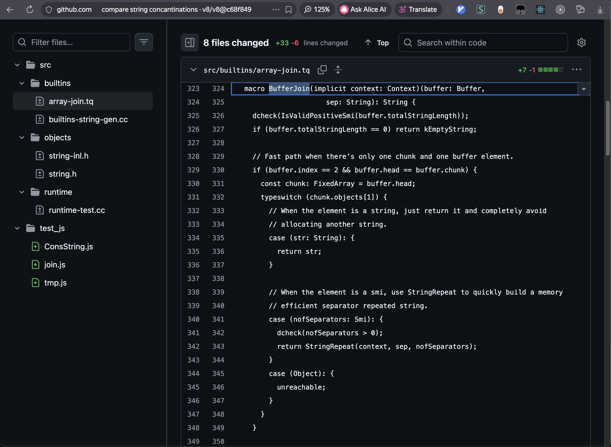
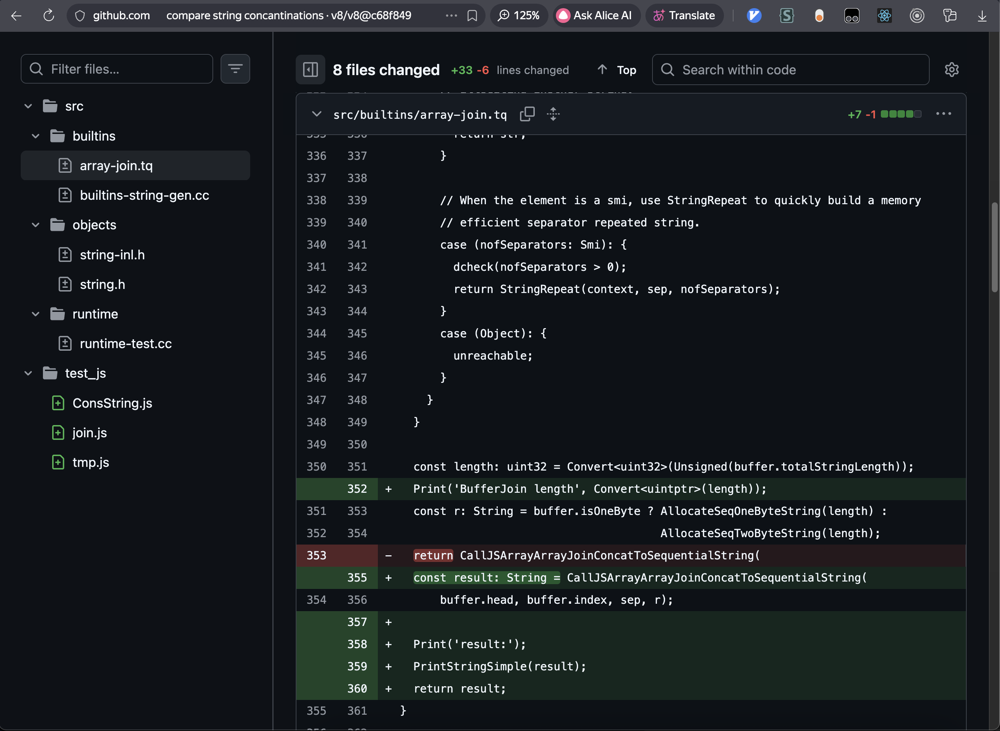

# v8 strings

QR Code to this page:


## Speedtest `+=` vs `join`

### `+=` code

```js
str = '';
for (let i = 0; i < 1_000; i++) {
  str += i;
}
```

### `join` code

```js
str = '';
arr = [];
for (let i = 0; i < 1_000; i++) {
	arr.push(i);
	str = arr.join('');
}
```

### JSBench.Me

#### Generating stroke


https://jsbench.me/wymmwc5lqz/1

#### Using stroke


https://jsbench.me/vvmmwc6bts/1

## What to build

V8 is an embeddable engine designed as a library. It can be integrated into any C++ application.
**Primary consumers:**
- **Chromium / Chrome** — the primary consumer
- **Node.js** — server-side JavaScript
- **d8** — a minimal debugging shell, shipped with V8

## How to build v8 on mac arm

### Main steps

1. find v8 repo
   https://github.com/v8/v8
2. get `depot_tools` (package of helper scripts)
   https://www.chromium.org/developers/how-tos/install-depot-tools/
3. build d8 (v8 debugging shell)
   https://v8.dev/docs/d8

#### Set up the environment

4. install xcode
   https://apps.apple.com/us/app/xcode/id497799835
5. install Xcode Command Line Tools

### full build sh in 9 lines

```sh
git clone https://chromium.googlesource.com/chromium/tools/depot_tools.git --depth 1

echo "export PATH=$(pwd)/depot_tools:\$PATH" >> ~/.zshrc
source ~/.zshrc

fetch --nohistory v8

cd v8
gn gen out/foo --args='target_cpu="arm64"'
ninja -C out/foo d8

echo "console.log('Hello world!');" > test.js
./out/foo/d8 test.js
```

### video

1. download from github: [build_v8_d8.mp4](build_v8_d8.mp4)
2. see on yandex disk: [https://disk.yandex.ru/i/pvOYS6Pa6MfYZA](https://disk.yandex.ru/i/pvOYS6Pa6MfYZA)

## DevTools Memory Snapshots

### Try code asis

```js
str = '';
for (let i = 0; i < 1_000; i++) {
  str += i;
}
```


### Try 2 snapshots


### With classes

```js
function FooPlus() {
  this.str = '';
  for (let i = 0; i < 1_000; i++) {
    this.str += i;
  }
}
fooPlus = new FooPlus();

function FooJoin() {
  this.arr = [];
  this.str = '';
  for (let i = 0; i < 1_000; i++) {
    this.arr.push(i);
  }
  this.str = this.arr.join('');
}
fooJoin = new FooJoin();
```


### Using strings

```js
function FooPlus() {
  this.str = '';
  for (let i = 0; i < 1_000; i++) {
    this.str += i;
  }
}
fooPlus = new FooPlus();
fooPlus.str[0];          // <---

function FooJoin() {
  this.arr = [];
  this.str = '';
  for (let i = 0; i < 1_000; i++) {
    this.arr.push(i);
  }
  this.str = this.arr.join('');
}
fooJoin = new FooJoin();
fooJoin.str[0];          // <---
```


### 20 elements

```js
function FooPlus() {
  this.str = ''; //   \/
  for (let i = 0; i < 20; i++) { // <---
    this.str += i; // /\
  }
}
fooPlus = new FooPlus();
```


### 11 elements

```js
function FooPlus() {
  this.str = ''; //   \/
  for (let i = 0; i < 11; i++) { // <---
    this.str += i; // /\
  }
}
fooPlus = new FooPlus();
```


## Debug sources

commit:  
https://github.com/v8/v8/commit/c68f8492328eff48b8dcc04164431b7147706087

### BufferJoin

`src/builtins/array-join.tq`
```diff
  macro BufferJoin(implicit context: Context)(buffer: Buffer,
                      sep: String): String {
    dcheck(IsValidPositiveSmi(buffer.totalStringLength));
    if (buffer.totalStringLength == 0) return kEmptyString;

    // Fast path when there's only one chunk and one buffer element.
    if (buffer.index == 2 && buffer.head == buffer.chunk) {
      const chunk: FixedArray = buffer.head;
      typeswitch (chunk.objects[1]) {
        // When the element is a string, just return it and completely avoid
        // allocating another string.
        case (str: String): {
          return str;
        }

        // When the element is a smi, use StringRepeat to quickly build a memory
        // efficient separator repeated string.
        case (nofSeparators: Smi): {
          dcheck(nofSeparators > 0);
          return StringRepeat(context, sep, nofSeparators);
        }
        case (Object): {
          unreachable;
        }
      }
    }

    const length: uint32 = Convert<uint32>(Unsigned(buffer.totalStringLength));
+   Print('BufferJoin length', Convert<uintptr>(length));
    const r: String = buffer.isOneByte ? AllocateSeqOneByteString(length) :
                                         AllocateSeqTwoByteString(length);
-   return CallJSArrayArrayJoinConcatToSequentialString(
+   const result: String = CallJSArrayArrayJoinConcatToSequentialString(
        buffer.head, buffer.index, sep, r);
    
+   Print('result:');
+   PrintStringSimple(result);
+   return result;
  }
```





`src/builtins/array-join.tq`
```diff
  // Calculates the running total length of the resulting string.  If the
  // calculated length exceeds the maximum string length (see
  // String::kMaxLength), throws a range error.
  macro AddStringLength(
      implicit context: Context)(lenA: intptr, lenB: intptr): intptr {
    try {
      const length: intptr = TryIntPtrAdd(lenA, lenB) otherwise IfOverflow;
      if (length > kStringMaxLength) goto IfOverflow;
+     Print("AddStringLength Length", Convert<uintptr>(length));
      return length;
    } label IfOverflow deferred {
      ThrowInvalidStringLength(context);
    }
  }
```

## tq

https://v8.dev/docs/torque#how-torque-generates-code

## Related links

- Юрий Карпов - Измеряем настоящую цену абстракций в JavaScript
  [https://youtu.be/UNHNgHWyCGc](https://youtu.be/UNHNgHWyCGc)
- Внутреннее представление и оптимизации строк в JavaScript-движке V8: «отмываем» строки, «обгоняем» C++
  https://habr.com/ru/companies/ruvds/articles/745008/
- Read about torque
  https://www.jfokus.se/jfokus20-preso/V8-Torque--A-Typed-Language-to-Implement-JavaScript.pdf
- Alternative Installing V8 on a Mac doc
  https://gist.github.com/kevincennis/0cd2138c78a07412ef21
- Devtools Memory Snapshots Extra
  [./DevTools_Memory_Snapshots_Extra](./DevTools_Memory_Snapshots_Extra)

